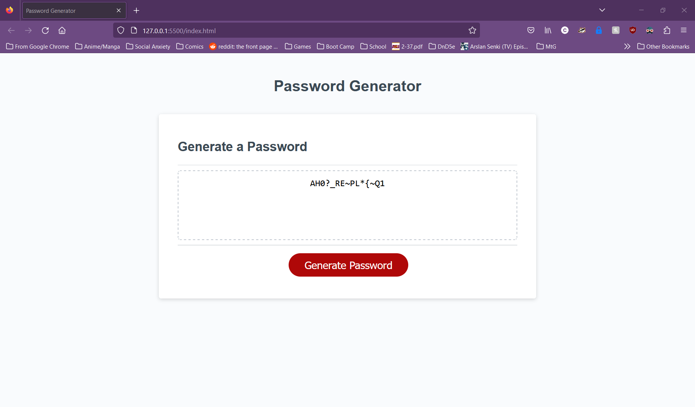

# Password Generator Starter Code

## User Story
AS AN employee with access to sensitive data
I WANT to randomly generate a password that meets certain criteria
SO THAT I can create a strong password that provides greater security

## Acceptance Criteria
GIVEN I need a new, secure password

WHEN I click the button to generate a password
THEN I am presented with a series of prompts for password criteria

WHEN prompted for password criteria
THEN I select which criteria to include in the password

WHEN prompted for the length of the password
THEN I choose a length of at least 8 characters and no more than 128 characters

WHEN asked for character types to include in the password
THEN I confirm whether or not to include lowercase, uppercase, numeric, and/or special characters

WHEN I answer each prompt
THEN my input should be validated and at least one character type should be selected

WHEN all prompts are answered
THEN a password is generated that matches the selected criteria

WHEN the password is generated
THEN the password is either displayed in an alert or written to the page

## Description

A password generator that allows for the user to pick and choose what they want randomly generated in a password between length and four different character types. This assignment was good practice for hands on practice for using a string array, combining arrays, and working on an if function.

## Usage

The user will be given five prompts upon pressing the button that will need to be answered before a password is generated. The length will need to be between 8 and 128 characters long, and must choose at least one option out of the four different character types (uppercase letters, lowercase letters, numbers, and symbols). If not, the user will be prompted to try again.

## Credits

Many thanks to my fellow students for helping me figure out a lot of things.

## Link
https://achurale.github.io/Password-Generator/
